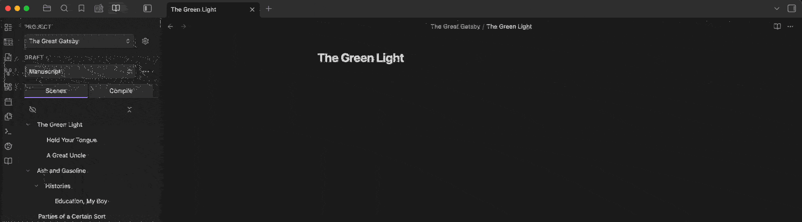
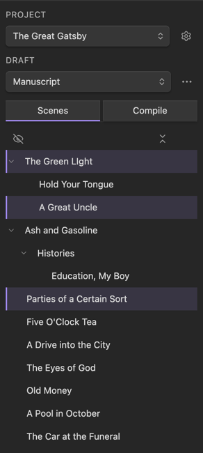
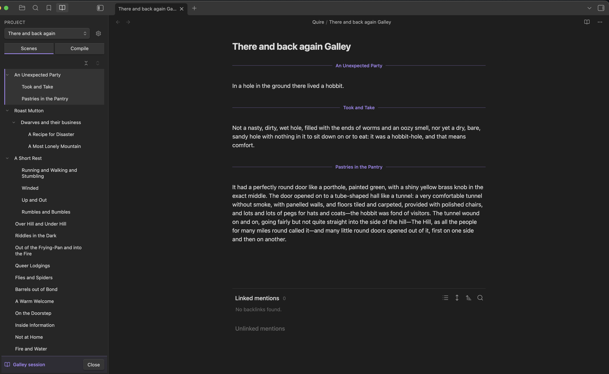
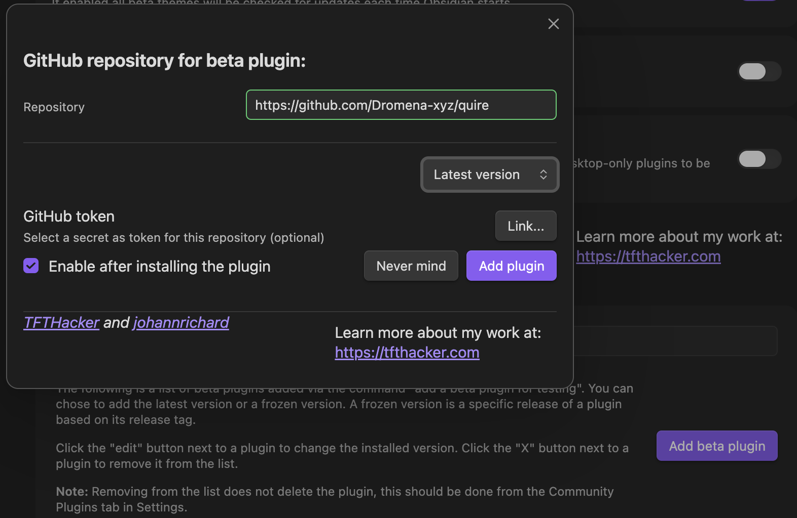
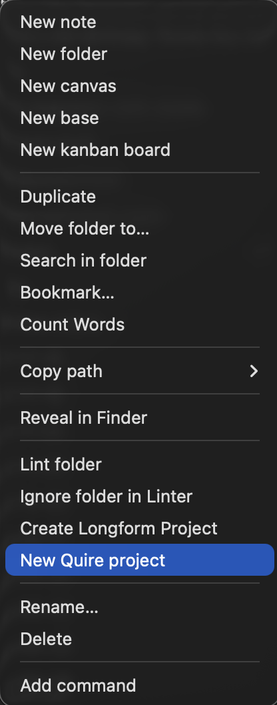

# Quire

**Long-form writing in Obsidian.**

Start a Quire project anywhere in your vault and build it up scene by scene.
Arrange the scenes into a nestable outline, write across them as one continuous
document, and compile the result into a finished manuscript for a reader or
editor. It's made for work that outgrows a single note: a novel, a
dissertation, a screenplay, and more.

## What you get

**Projects and scenes.** A Quire project is a folder of scenes. Create one
anywhere, then fill it in. Every scene you add shows up in the Quire pane as a
reorderable, nestable outline. Drag to reorder, nest one scene under another,
and move a parent to carry its children with it. They stay ordinary notes
throughout, so the rest of Obsidian keeps working on them.

**Galley.** Open a scene together with its children, or hand-pick any set of
scenes, and write them as one flowing document. Your edits save back into each
individual scene as you type, so you get the focus of a single page without
losing the outline underneath. Writers who know Scrivener will recognize the
idea as Scrivenings. Galley is Quire's version, rebuilt for Obsidian.

**Compile.** Turn your scenes into one finished manuscript. You assemble a
*workflow* from steps that tidy the draft on the way out, dropping frontmatter,
stripping the wikilinks and callouts and other Obsidian markup that shouldn't
reach a reader, prepending scene titles, setting your own separators, and
writing the result to any note. Scenes can sit out of a compile without being
deleted, and every project keeps its own workflow, so a novel and a research
paper export differently.

## Buy a license

Two ways to pay, and both unlock everything:

- **[Subscribe, $5 a month](https://buy.stripe.com/9B69AU4i39tg4Bq92dbAs05)**
- **[Pay once, $34 or more](https://buy.stripe.com/cNi4gA4i3bBod7W5Q1bAs07)**

A subscription converts to a permanent license after ten monthly payments. From
then on Quire is yours to keep. The subscription keeps billing until you cancel
it, though, so if you'd like to stop there, cancel it yourself in your Link
account, which your receipt and billing emails link to.

Anything past the tenth payment is patronage, plain and simple, and it goes
straight into Quire's development. We're grateful if you keep it going.

Your license key arrives by email right after you buy. Keep that email and store
the key somewhere safe. It's how you activate Quire, and how you reactivate
after a reinstall. One license covers five activations (see
[Where your license works](#where-your-license-works)).

## Install

Quire installs from GitHub rather than from Obsidian's plugin directory (the
Community plugins list in Obsidian's settings), which isn't accepting new
closed-source plugins for now. There are two ways in, and both finish at the
same activation step.

### With BRAT (recommended)

> [!TIP]
> [BRAT](https://github.com/TfTHacker/obsidian42-brat) is a free, third-party
> community plugin that installs and updates other plugins straight from
> GitHub. It's the simplest way to install Quire and keep up with new releases.

1. Install **BRAT**: open **Settings → Community plugins → Browse**, search for
   **BRAT**, then install and enable it.
2. Open **Settings → BRAT** and select **Add beta plugin**.
3. Enter `Dromena-xyz/quire`, then select **Add plugin**. BRAT installs Quire
   and afterward checks the repo for new releases.
4. Open **Settings → Community plugins** and make sure **Quire** is enabled.
5. Open **Settings → Quire**, paste the license key from your purchase email,
   and select **Activate**.

### By hand (you control updates)

1. From the
   [latest release](https://github.com/Dromena-xyz/quire/releases/latest),
   download `main.js`, `manifest.json`, and `styles.css`.
2. In your vault, create the folder `.obsidian/plugins/quire/` and put the
   three files inside it.
3. In Obsidian, open **Settings → Community plugins** and enable **Quire**
   (turn off Restricted mode if prompted).
4. Open **Settings → Quire**, paste your license key, and select **Activate**.

> [!NOTE]
> Quire tells you when a new version is out, but never updates itself. BRAT can
> pull updates as they ship; installing by hand lets you decide exactly when
> Quire changes, which is handy in the middle of a draft.

## Getting started

1. **Create a project.** Right-click any folder and choose **New Quire
   project**, then give it a name. Quire makes a fresh project folder for it. A
   project can sit anywhere in your vault, but not inside another Quire project.
2. **Open the Quire pane.** Select the **Open Quire** ribbon icon, the open
   book. Your project and its scenes appear on the **Scenes** tab.
3. **Add and arrange scenes.** Type a title into the **New scene** field to add
   one. Drag a scene **between** two rows to reorder it, drop it **onto** another
   scene to nest it as a child, or drop it **below the list** to move it to the
   top level. Right-click a scene for **Outdent**/**Indent** if you'd rather move
   one level at a time. Select several scenes (modifier-click, or **Add to
   selection** in the menu) to move, nest, delete, or ignore them as a group,
   children included.
4. **Write in Galley.** Right-click a scene and choose **Open in Galley** to
   write it and its children together as one continuous document, or select
   several scenes and open those as one. Your edits save back into each scene as
   you go.
5. **Compile.** Switch to the **Compile** tab, choose or build a workflow, and
   select **Compile**. Quire writes the finished manuscript into your vault and
   tells you where it landed.

For a closer look at each feature, see the **[documentation](docs/)**.

## Coming from Longform?

Quire imports your existing Longform projects. Run **Import a Longform project**
from the command palette, or open **Settings → Quire** and select **Import a
project** under "Switching from Longform." Quire finds your Longform projects and brings
them in without changing or deleting anything Longform owns. You can copy a
project into a new folder, or add a Quire index in place next to the Longform
one. Either way Quire shows you exactly what will happen before it writes
anything, and each Longform draft comes in as its own Quire project.

## Where your license works

One license covers **five activations**, where an activation is one vault on one
device. For example:

- One vault synced to your laptop and desktop uses two.
- A second vault, kept apart from the first, on that laptop uses a third.
- Those two vaults on a third machine use the last two.

Quire ties an activation to a vault and a device because that's the granularity
Obsidian gives a plugin for storing a license securely. The key lives in that
vault's own secure storage, on the machine where you activated it, and Obsidian
doesn't carry it between vaults or machines. So syncing or sharing a vault's
files never spends an activation on its own. Opening that vault on a new device
is what does. Done with one? Deactivate it from that vault's Quire settings to
free the slot.

## Requirements

Obsidian 1.11.4 or later, on macOS, Windows, or Linux desktop.

> [!NOTE]
> Mobile is on the roadmap, not in this release. We want it to work cleanly with
> Quire's per-device licensing before we ship it. See [Roadmap](#roadmap).

## Roadmap

Quire launches lean and keeps growing. The goal behind every release is to bring
what writers love about Scrivener into something fully Obsidian-native, built on
notes. Some of what's ahead:

- **Mobile.** Write on phone and tablet once we can support it without the
  licensing quirks noted above.
- **An account page.** Manage your license and devices from the web, not only
  from inside the plugin.
- **More compile power**, and closer parity with the tools writers come from.

## Lineage

None of this is a new idea, and that's a compliment to the writers and tools
that arrived first. Apps like Scrivener taught a generation to work in scenes,
draft them together, and compile the result.
[Longform](https://github.com/kevboh/longform) brought that way of working to
Obsidian and carried it for years as a free, open-source labor of love that
plenty of us, this author included, wrote real words on.

Quire owes Longform a real debt. The scenes-as-files model, the index that
orders them, compile as a stack of small steps: that shape is Longform's, and
Quire carries it forward. The code is its own, written from scratch in Svelte 5,
but the lineage isn't something to paper over.

Where Quire goes its own way: Galley, a Scrivenings-style editor that writes back
to every scene at once; scenes that nest as parent and child, so structure
travels on reorder; and being a paid product, which is how a tool like this
stays actively maintained (a lot to ask of volunteer time alone). A few familiar
touches make their own calls, too; a running word count isn't in Quire today.
Real gratitude to what came before, and to the writers still using it.

## Support

Found a bug or have a feature request? Open an issue on
[GitHub](https://github.com/Dromena-xyz/quire/issues). For anything to do with
your license or a payment, reply to your purchase email.

## Privacy and network use

Quire is local-first. Your writing stays on your machine: it never sends scene
text, file names, or any document content anywhere, and it collects no
analytics, telemetry, or tracking of any kind.

It uses the network for three things only: buying or activating a license, the
occasional license re-check while a subscription is active, and asking GitHub
whether a new version is out. A one-time license validates once, at activation,
and never again on its own. Everything else works fully offline.

A license check sends only what's needed to confirm the license, never your
notes. Your license is kept in your computer's secure storage rather than inside
the vault, which is why syncing or sharing a vault never shares your license
along with it.

A paid license is required for full access; activation lives in the plugin's
settings. The full specifics are in the [privacy policy](./PRIVACY.md).

## License

The contents of this repository, and all artifacts attached to its releases, are
released under a [proprietary license](./LICENSE.md). Source lives in a private
repository. Use of Quire is subject to the [Terms of Use](./TERMS.md).
