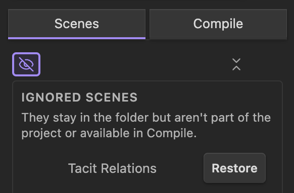

# The Scene List

The Quire pane shows your project as a list of scenes in reading order. This is
where you shape the draft: reorder, nest, group, and set scenes aside.

## Reorder and Nest

Drag a scene to move it. Quire reads where you drop it, so reordering and nesting
are one gesture:

- **Drop between two rows** to place the scene there as a sibling, at that depth.
- **Drop onto a row** to nest the scene in as that row's last child, one level
  deeper.
- **Drop below the list** to move the scene to the top level.

A parent carries its children: drag a scene that has a subtree and the whole
branch moves together and keeps its shape. If you would rather move one step at a
time, a scene's menu offers **Move up**, **Move down**, **Indent**, and
**Outdent**.

## Collapse and Expand

A scene with children shows a disclosure arrow. Collapse a branch to fold its
subtree away, or use the pane's toolbar to collapse or expand the whole project
at once, so you can work at the chapter level or zoom into a scene.

## Select Several at Once

Hold the multi-select modifier (set under [Settings](09-settings.md)) and click,
or use **Add to selection** in a scene's menu, to select more than one scene.
With a selection you can move, nest, open as a [Galley](04-galley.md), ignore, or
delete them all at once. Selecting a parent brings its children along.

## Ignore and Restore

Not everything in a project folder is a scene. You might keep an outline, notes,
or research alongside the draft. Mark a file as **ignored** to take it out of the
project without deleting it: it leaves the scene list, and because it is no longer
a scene it is also left out of any [Compile](05-compile.md). Ignored files
collect in their own panel, where **Restore** brings one back into the project as
a scene.

To keep a scene in the project but leave it out of a single export, exclude it in
the Compile tab instead. See [Compile](05-compile.md).

## The Scene Menu

Every scene's menu gathers its actions in one place: open in a Galley, rename,
insert a scene above or below, move and indent, ignore, and delete. The same
actions apply to a multi-selection wherever they make sense.
