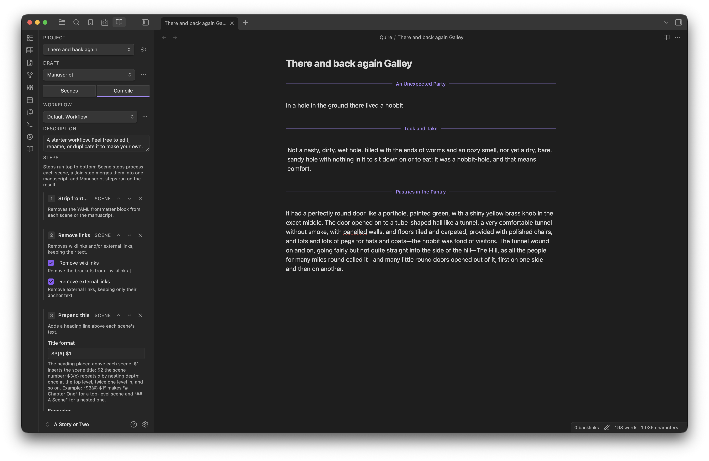

# Compile

Compile turns your scenes into one finished file: a single manuscript with the
cuts, formatting, and layout you want, ready to hand off or publish. It runs as an
ordered list of small steps, so you decide exactly how the raw scenes become the
final document, and you can keep different recipes for different outputs.

## Workflows and Steps

A **workflow** is a named, ordered list of **steps**. Build one in the Compile
tab: add steps, reorder them with the up and down arrows on each step,
and set each step's options. Quire ships a default workflow you can use as is or
copy and adjust.

Each step plays one of three roles, and steps run top to bottom:

- **Scene steps** transform every scene on its own, before the scenes are joined.
- **The join step** combines the scenes, in order, into a single manuscript.
- **Manuscript steps** transform the assembled manuscript as a whole.

The Compile tab flags a workflow whose steps fall out of order, for example a
scene step placed after the join, so you can fix it before running.

## The Built-in Steps

**Format each scene**

- **Prepend title** adds a heading above each scene, numbered however you like.

**Clean up the text**

- **Strip frontmatter** removes a scene's YAML frontmatter block.
- **Remove links** unwraps `[[wikilinks]]` and `[text](links)` to their visible
  text, leaving embeds in place.
- **Remove comments** strips `%% Markdown %%` and `<!-- HTML -->` comments.
- **Delete headers**, **Remove checkboxes**, **Remove callouts**, **Remove
  Dataview queries**, and **Remove strikethroughs** clear those elements when you
  do not want them in an export.

**Assemble and finish**

- **Concatenate text** is the join step: it merges the scenes with a separator
  you choose between them.
- **Add frontmatter** puts a YAML block at the top of the finished manuscript.
- **Save as note** writes the manuscript to a note in your vault.

Most steps have options, like which kinds of links or comments to remove, or the
separator placed between joined scenes. A blank line between scenes is written as
`\n\n` in a separator field.

## Custom Steps

When the built-in steps do not cover a change you want, write a
[custom step](12-custom-compile-steps.md): a small piece of JavaScript that runs
on your text in a sandbox, with no access to your files, the network, or your
system.

## Leave Scenes Out of an Export

Some scenes are notes to yourself you do not want in a finished file. In the
Compile tab, mark a scene as **excluded** and that workflow skips it, while the
scene stays in your project and your other workflows. (This is different from
[ignoring](03-the-scene-list.md) a file, which removes it from the project
entirely.)

## Where the Manuscript Lands

The **Save as note** step has two fields: a **Folder** to save into and a **File
name**. Leave the folder empty to save the manuscript in the project folder. Both
fields accept the same placeholders, so you can name the file after your project
or sort exports into dated folders:

- `$title` (or `$1`) for the project title.
- `$project` for the project folder's name.
- `$draft` for the draft-title label, if the project has one.
- `$date` for today's date, as `YYYY-MM-DD`.

A new step starts with an empty folder and `$title` as the file name, so it saves
to a note named after your project, in the project folder. In the folder field, a
leading `/` is relative to the vault root, and a leading `./` or `../` is relative
to the project folder; anything else is taken as relative to the project folder.
Quire adds `.md` if you leave the extension off the file name, and asks before
overwriting a note that already exists.

If the project has [drafts](13-drafts.md), Compile runs on the active draft, and
`$title` is that draft's name. A draft's manuscript saves into the draft's own
folder, so compiling a draft never overwrites the manuscript's export.

Run a workflow from the Compile tab, or with the **Compile current project**
command. Quire tells you where the manuscript was saved when it finishes.
