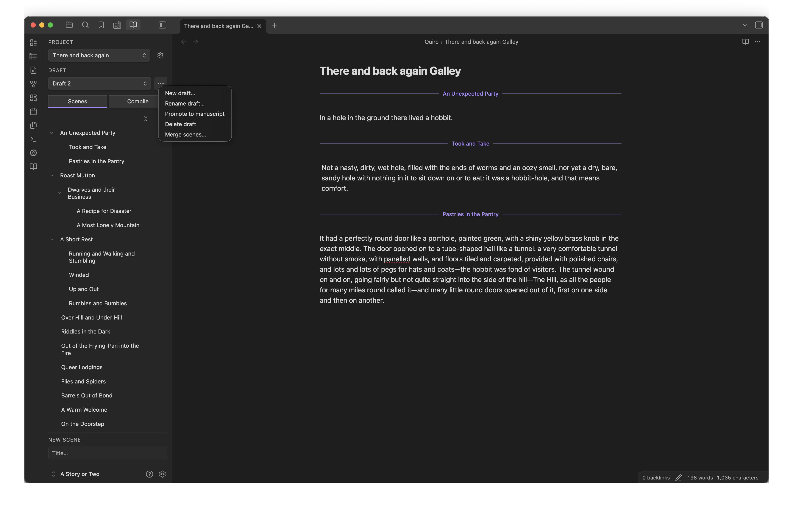
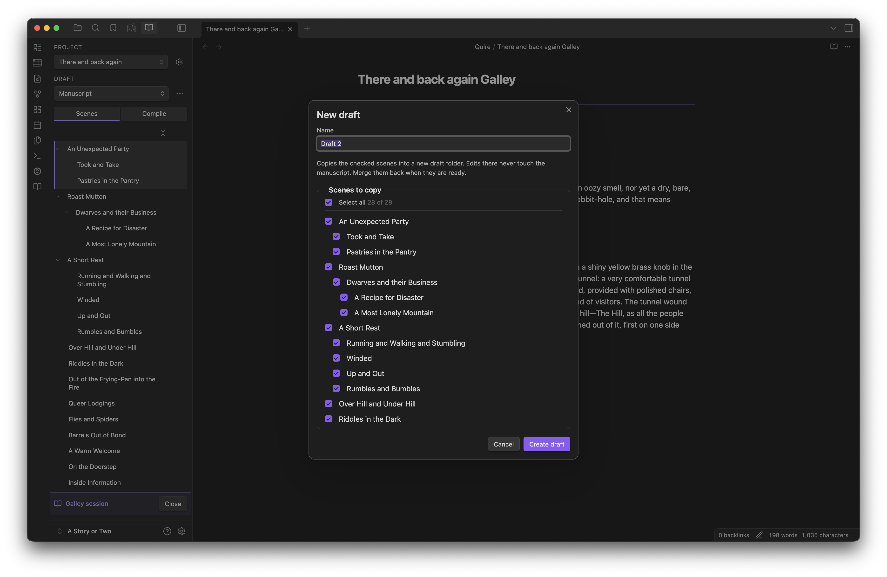

# Drafts

A draft is an alternate version of your project's scenes: a place to attempt the
bolder rewrite, reorder the chapters, or cut what you are not sure about,
without touching the version you trust. Your main version is the **manuscript**.
A draft is a real copy of the scenes you choose, so the two live side by side,
and nothing you do in one changes the other until you say so.

## Create a Draft

In the Quire pane, every project shows a **Draft** row. Open its **⋯** menu and
choose **New draft**, or run the **New draft** command. Quire suggests a name
("Draft 2", counting up) and asks which scenes to copy. All of them are selected
to start. Checking or unchecking a parent carries its children, and you can
uncheck a child while keeping its parent.

To start a draft from just the scenes you are reworking, select them in the
scene list and choose **New draft from selection** from the scene menu. Copying
only what you rework keeps a draft light: you never duplicate a whole novel to
redraft one chapter.

A draft lives in a subfolder of the project, named after the draft, with its own
index. Renaming the draft renames the folder.

## Switch Between Drafts

The Draft dropdown lists the manuscript and every draft. Whichever is active is
what the pane shows and what the rest of Quire acts on: the scene list,
[Galley](04-galley.md), and [Compile](05-compile.md) all follow the
active draft. The choice is saved with the project, so it is right where you
left it after a restart.

A draft is fully independent while you work. Its scenes are their own notes, and
edits, reorders, and deletions in a draft never touch the manuscript.

## Merge Scenes Back

When some of a draft's scenes are ready, bring them back. Open the Draft row's
**⋯** menu and choose **Merge scenes**. Pick the source and target drafts (the
manuscript is the usual target), then pick scenes. Checking a parent brings its
children, and you can uncheck any child to leave it behind.

For a scene that exists in both drafts, choose how it comes in:

- **Replace**, the default, swaps the target scene's text in place. The scene
  keeps its spot in the target; only the words change.
- **Add a copy** keeps both versions: the draft's version comes in as a new,
  numbered note beside the original.

Scenes that exist only in the source are always added, in their place and with
their nesting intact. Copying a parent scene brings its children as part of the
copy. Two batch buttons set every matched scene to Replace, or to copies, at
once.

Merging changes text and adds scenes. It never reorders or removes what is
already in the target, so the manuscript's structure is always yours. The
summary at the bottom states exactly what will happen, and a confirmation asks
before anything is overwritten. To bring over a draft's *structure*, its order
and nesting, promote the draft instead.

## Promote a Draft

When a draft has become the book, make it the manuscript. Open the Draft row's
**⋯** menu and choose **Promote to manuscript**, or run the **Promote draft to
manuscript** command.

Promoting is wholesale: the draft's scenes, order, and nesting take over. The
old manuscript's scenes move to your trash, following your Obsidian "Deleted
files" setting, so you can usually restore them. The project keeps its name,
compile workflow, and settings, and the draft itself goes away once its scenes
move up. Close any Galley tabs in the project first; Quire will remind you.

## Rename and Delete

Both live in the Draft row's **⋯** menu. Renaming a draft renames its folder.
Deleting a draft moves its folder to your trash; the manuscript and your other
drafts are untouched.

## On Disk

A draft is a normal subfolder inside the project, holding its own
`_quire_index.md` and its scene notes, and everything in
[How Quire Stores Your Work](08-how-quire-stores-your-work.md) applies to it.
Drafts go one level deep: a draft cannot hold drafts of its own.

Compile follows the active draft, and `$title` in the **Save as note** step is
the active draft's name, so the compiled file lands inside the draft's own
folder and never overwrites the manuscript's export.

Coming from Longform with multiple drafts? The importer brings them in as one
project. See [Coming from Longform](06-coming-from-longform.md).
